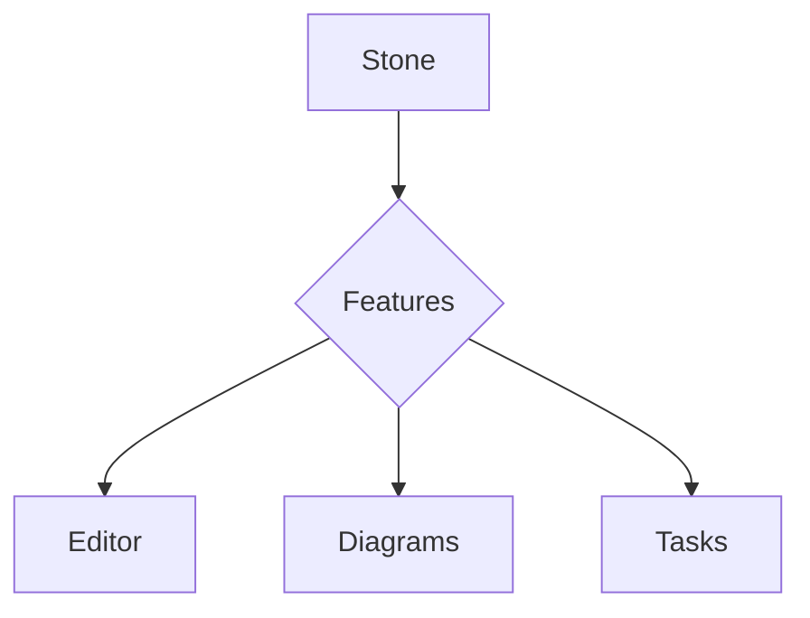

<h1 align="center">
  
  <br />
  Stone
</h1>

<p align="center">
  <strong>A beautiful, local-first note-taking app built with Rust & Tauri</strong>
</p>

<p align="center">
  <a href="#features">Features</a> •
  <a href="#why-stone">Why Stone?</a> •
  <a href="#installation">Installation</a> •
  <a href="#development">Development</a> •
  <a href="#roadmap">Roadmap</a>
</p>

<p align="center">
  
  
  
  
</p>

---

## Why Stone?

Stone is a **production-ready note-taking app** that combines the elegance of Notion with the speed and privacy of local-first software. Built from the ground up with **Rust** and **Tauri**, it's blazing fast, incredibly lightweight (~20MB!), and your data never leaves your machine.

**Your notes, your rules.** Everything is stored as plain Markdown files on your computer—no cloud lock-in, no subscriptions, no tracking.

---

## ✨ Features

### 📝 Rich Block-Based Editor

Powered by **TipTap** (ProseMirror), offering a Notion-like editing experience:

- **Slash Commands** (`/`) — Headings, lists, code blocks, quotes, tables, and more
- **Block Hover Actions** — Drag handles and quick-add buttons on every block
- **Smart Formatting** — Bold, italic, strikethrough, highlights, inline code
- **Tables** — Full table support with intuitive editing
- **Images** — Drag & drop or paste images directly into notes
- **Links** — Smart bidirectional linking between notes

### 📊 Mermaid Diagrams

Create beautiful diagrams right inside your notes:



Supports flowcharts, sequence diagrams, class diagrams, ER diagrams, Gantt charts, and more.

### 💻 Developer-Friendly Code Blocks

- **Syntax Highlighting** — 20+ languages (TypeScript, Python, Rust, Go, SQL, etc.)
- **Language Selector** — Easy dropdown to switch languages
- **Custom Theme** — Beautiful colors that match the app's design

### ✅ Flexible Task Management

Logseq-inspired task states for agile workflows:

- `TODO` → `DOING` → `DONE`
- Additional states: `WAITING`, `HOLD`, `CANCELED`, `IDEA`
- Click task badges to cycle through states
- Extract tasks from anywhere in your notes

### 📓 Daily Journal

Start each day with a fresh page:

- Automatically opens today's journal on launch
- Organized in `Journal/` folder with date-based filenames (`YYYY-MM-DD.md`)
- Perfect for daily notes, standup logs, or morning pages
- **Quick Capture** (`Alt+Space`) — Instantly append to today's journal from anywhere

### 🗂️ Powerful Organization

- **Workspaces** — Multiple vaults for different projects or areas of life
- **Folders** — Hierarchical organization with file tree navigation
- **Tags** — Cross-cutting categorization with multi-select
- **Notebooks** — Group related notes together
- **Favorites & Pins** — Quick access to important notes

### 🔍 Search & Discovery

- **Full-Text Search** — Find notes by content (basic implementation)
- **File Tree Browser** — Navigate your workspace like a file manager
- **Recent Notes** — Quickly access your latest work
- **Archived Notes** — Keep your workspace clean

### 🔗 Knowledge Graph

Visualize connections between notes:

- **Interactive Graph** — Powered by `react-force-graph`
- **Bidirectional Links** — See all connections at a glance
- **Force-Directed Layout** — Automatically organizes related notes

### 🎨 Beautiful Design

Crafted with obsessive attention to detail:

- **Typography** — Inter for UI, Barlow for content, Fira Code for code
- **Dark Mode** — System-aware with manual override
- **Notion-Inspired** — Clean, spacious, focused interface
- **Native Feel** — macOS-style title bar and native scrollbars
- **Smooth Animations** — Polished transitions throughout

### ⚡ Local-First & Fast

- **Markdown Files** — Plain text that works everywhere
- **No Cloud Required** — Everything stays on your machine
- **Git-Friendly** — Version control your notes naturally
- **Instant Saves** — Auto-save with file watcher sync
- **SQLite Metadata** — Lightning-fast queries for notes list

### 🔄 File System Integration

- **File Watcher** — Real-time sync with external changes
- **Markdown Export** — Already in Markdown!
- **Git Integration** — Initialize repos, commit, and view history
- **External Editor Support** — Edit files in VSCode, Vim, etc.

### 🎯 Quick Capture Window

Global hotkey (`Alt+Space`) to quickly capture thoughts:

- Appears on current monitor (Raycast-style)
- Appends to today's journal
- Auto-refreshes editor if journal is open
- Works with Aerospace/yabai window managers

---

## 🏗️ Architecture

Stone is built with **Hexagonal Architecture** (Ports & Adapters), ensuring clean separation of concerns and testability:

```
┌─────────────────────────────────────┐
│   Frontend (React + TypeScript)    │
│   • TipTap Editor                   │
│   • Zustand State                   │
│   • Radix UI Components             │
└──────────────┬──────────────────────┘
               │ Tauri IPC
┌──────────────▼──────────────────────┐
│     Adapters IN (Tauri Commands)    │
├─────────────────────────────────────┤
│   Application Layer (Use Cases)     │
│   • Note, Workspace, Tag, Topic     │
│   • Search, Task, Graph, Git        │
├─────────────────────────────────────┤
│      Domain Layer (Entities)        │
│   • Pure business logic             │
│   • No framework dependencies       │
├─────────────────────────────────────┤
│    Adapters OUT (Implementations)   │
│   • Diesel Repository (SQLite)      │
│   • File Storage (Tokio FS)         │
│   • Event Publisher (Broadcast)     │
│   • File Watcher (Notify)           │
└──────────────┬──────────────────────┘
               │
        ┌──────▼─────┬────────────┐
        │            │            │
    SQLite      Markdown       Events
  (Metadata)    (Content)    (Real-time)
```

---

## 🚀 Installation

### Download

> **Note:** Downloadable releases coming soon!

For now, build from source (see [Development](#development) below).

### System Requirements

- **macOS**: 10.15 (Catalina) or later
- **Windows**: 10/11
- **Linux**: Modern distro with glibc 2.31+

---

## 💻 Development

### Prerequisites

- **Rust** 1.70+ ([Install](https://rustup.rs/))
- **Node.js** 20+ and **pnpm** ([Install](https://pnpm.io/installation))
- **Tauri CLI** (installed via npm)

### Quick Start

```bash
# Clone the repository
git clone https://github.com/yourusername/stone-tauri.git
cd stone-tauri

# Install dependencies
pnpm install

# Run in development mode
pnpm tauri dev

# Build for production
pnpm tauri build
```

### Project Structure

```
stone-tauri/
├── src/                      # Frontend (React + TypeScript)
│   ├── components/
│   │   ├── base/            # Base UI components
│   │   ├── composites/      # Composite components
│   │   └── features/        # Feature-specific components
│   ├── hooks/               # Custom React hooks
│   ├── stores/              # Zustand state stores
│   ├── api/                 # Tauri IPC API
│   └── utils/               # Utilities
│
├── src-tauri/src/           # Backend (Rust)
│   ├── domain/              # Pure business logic
│   │   ├── entities/        # Note, Workspace, Tag, etc.
│   │   └── ports/           # Interfaces (traits)
│   ├── application/         # Use cases
│   ├── adapters/
│   │   ├── inbound/         # Tauri commands
│   │   └── outbound/        # Repository implementations
│   ├── infrastructure/      # DI container, database
│   └── shared/              # Diesel schema
│
└── migrations/              # SQLite migrations
```

### Available Commands

```bash
pnpm dev              # Start Vite dev server
pnpm build            # Build frontend
pnpm tauri dev        # Run Tauri app in dev mode
pnpm tauri build      # Build production app
cargo test            # Run Rust tests
cargo clippy          # Lint Rust code
```

---

## 🗺️ Roadmap

### ✅ Completed

- [x] Rich block-based editor (TipTap)
- [x] Mermaid diagram support
- [x] Syntax-highlighted code blocks
- [x] Task management with multiple states
- [x] Daily journal with quick capture
- [x] Workspaces, folders, tags, notebooks
- [x] File watcher & real-time sync
- [x] Knowledge graph visualization
- [x] Git integration (init, commit, history)
- [x] Markdown export (native format)
- [x] File tree browser
- [x] Settings & preferences
- [x] Dark mode
- [x] Recovery mode
- [x] Global quick capture hotkey
- [x] Command palette
- [x] Bidirectional links

### 🚧 In Progress

- [ ] **ML-Powered Topic Classification**
  - ✅ Embedding service (FastEmbed) implemented
  - ✅ Topic entities and database schema ready
  - ⏳ Topic classifier training and inference
  - ⏳ Auto-classification on note save
  - ⏳ Topic-based note discovery

- [ ] **Full-Text Search with Tantivy**
  - ⏳ Index notes content for instant search
  - ⏳ Fuzzy matching and ranking
  - ⏳ Incremental index updates

- [ ] **Semantic Search**
  - ⏳ Use embeddings for similarity search
  - ⏳ "Find similar notes" feature
  - ⏳ Hybrid search (FTS + semantic)

### 📋 Planned

- [ ] **PDF Export** (headless Chrome)
- [ ] **Mobile Apps** (iOS & Android via Tauri Mobile)
- [ ] **Plugin System** (WASM-based)
- [ ] **Collaborative Editing** (CRDT-based)
- [ ] **End-to-End Encryption** (optional)
- [ ] **Cloud Sync** (optional, via Git/S3)
- [ ] **Web Clipper** (browser extension)
- [ ] **Spaced Repetition** (flashcards)
- [ ] **Canvas Mode** (infinite whiteboard)

---

## 🎓 Tech Stack

### Frontend

| Technology | Purpose |
|------------|---------|
| **React 18** | UI framework |
| **TypeScript** | Type safety |
| **TipTap** | Rich text editor |
| **Tailwind CSS 4** | Styling |
| **Radix UI** | Accessible components |
| **Zustand** | State management |
| **Vite** | Build tool |
| **Mermaid** | Diagrams |
| **Highlight.js** | Code syntax |

### Backend

| Technology | Purpose |
|------------|---------|
| **Rust** | Systems programming |
| **Tauri 2** | Desktop framework |
| **Diesel** | ORM & migrations |
| **SQLite** | Database |
| **Tokio** | Async runtime |
| **Notify** | File watcher |
| **Git2** | Git integration |
| **FastEmbed** | Text embeddings |

### Why This Stack?

- **90% Smaller** — ~20MB vs ~200MB (Electron)
- **10x Faster Startup** — Native binary vs JS runtime
- **Memory Efficient** — Rust's zero-cost abstractions
- **Secure** — Rust safety + Tauri's security model
- **Cross-Platform** — Single codebase for all platforms
- **Future-Proof** — Hexagonal architecture for easy evolution

---

## 🔧 Database Schema

Stone uses a **hybrid storage model**:

- **SQLite** stores metadata (titles, timestamps, tags)
- **Markdown files** store content
- **Best of both worlds**: Fast queries + portable content

```sql
CREATE TABLE notes (
  id TEXT PRIMARY KEY,
  title TEXT NOT NULL,
  workspace_id TEXT,
  notebook_id TEXT,
  file_path TEXT,
  is_favorite INTEGER DEFAULT 0,
  is_pinned INTEGER DEFAULT 0,
  is_archived INTEGER DEFAULT 0,
  is_deleted INTEGER DEFAULT 0,
  deleted_at TEXT,
  embedding BLOB,  -- Vector embedding for semantic search
  created_at TEXT NOT NULL,
  updated_at TEXT NOT NULL
);

CREATE TABLE topics (
  id TEXT PRIMARY KEY,
  name TEXT NOT NULL UNIQUE,
  description TEXT,
  color TEXT,
  centroid BLOB,  -- Topic centroid for classification
  created_at TEXT NOT NULL,
  updated_at TEXT NOT NULL
);

CREATE TABLE note_topics (
  note_id TEXT NOT NULL,
  topic_id TEXT NOT NULL,
  confidence REAL NOT NULL,
  PRIMARY KEY (note_id, topic_id)
);
```

---

## 🤝 Contributing

Contributions are welcome! Stone is built with clean architecture principles, making it easy to add features.

### Adding a New Feature

1. **Define Domain Entity** (`src-tauri/src/domain/entities/`)
2. **Create Repository Port** (`src-tauri/src/domain/ports/outbound/`)
3. **Define Use Case Port** (`src-tauri/src/domain/ports/inbound/`)
4. **Implement Use Case** (`src-tauri/src/application/usecases/`)
5. **Implement Repository** (`src-tauri/src/adapters/outbound/persistence/`)
6. **Add Tauri Commands** (`src-tauri/src/adapters/inbound/`)
7. **Wire DI Container** (`src-tauri/src/infrastructure/container.rs`)
8. **Build UI** (`src/components/features/`)

### Guidelines

- Follow hexagonal architecture principles
- Write unit tests for domain logic
- Use descriptive commit messages
- Update documentation

---

## 📄 License

MIT © [Your Name](https://github.com/yourusername)

---

## 🙏 Acknowledgments

Built with amazing open-source technologies:

- [Tauri](https://tauri.app/) — Desktop app framework
- [TipTap](https://tiptap.dev/) — Headless editor
- [Diesel](https://diesel.rs/) — Safe ORM
- [Radix UI](https://www.radix-ui.com/) — Accessible components
- [Mermaid](https://mermaid.js.org/) — Diagram syntax
- [FastEmbed](https://github.com/Anush008/fastembed-rs) — Text embeddings

---

<p align="center">
  <sub>Built with 🦀 Rust and ❤️ for deep work</sub>
</p>
