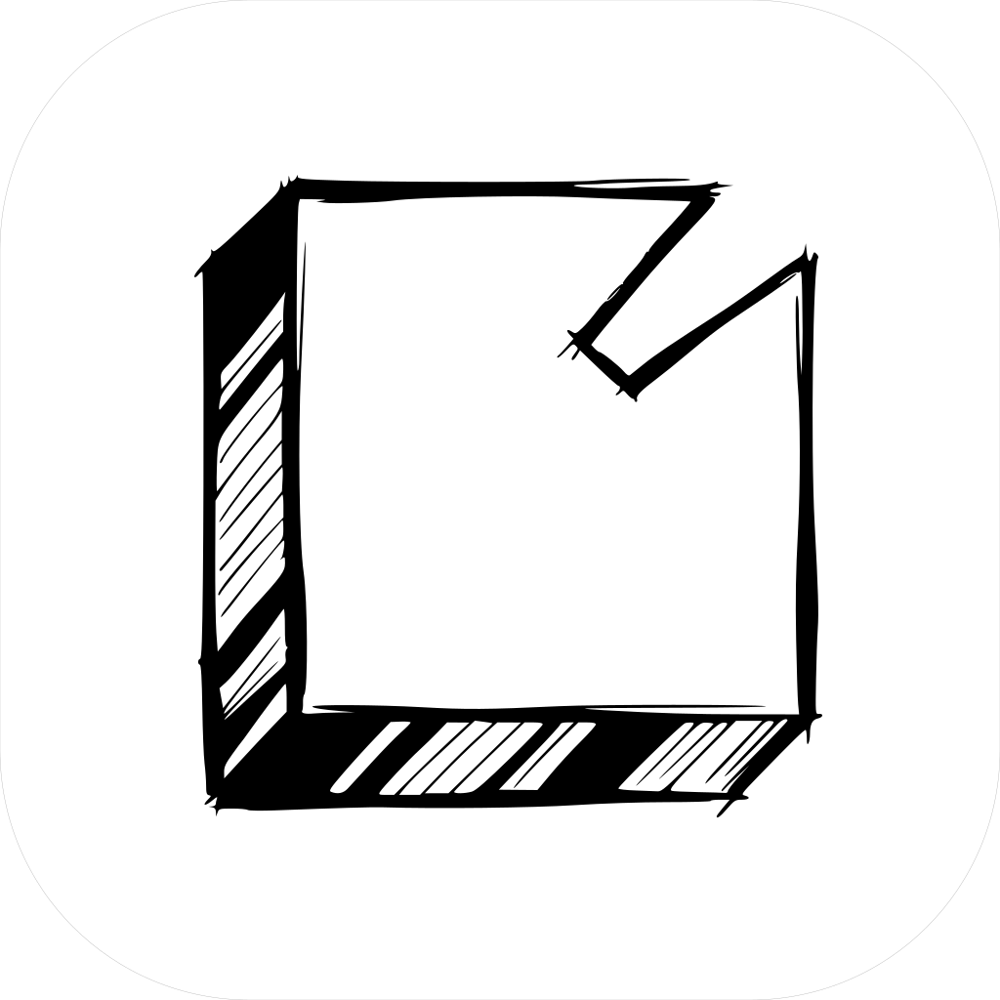
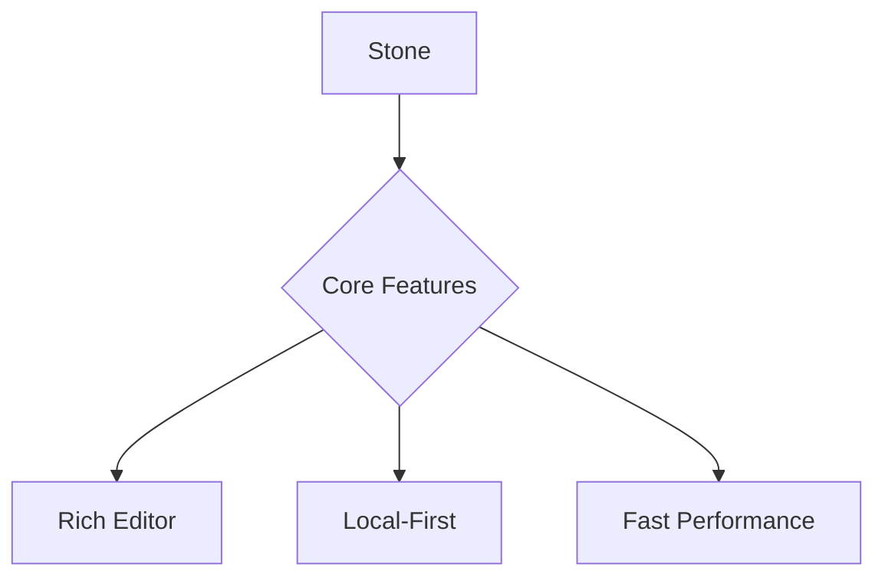

<div align="center">



# Stone

**A beautiful, local-first note-taking application**

Built with Rust and Tauri for exceptional performance and elegance

[Features](#features) • [Architecture](#architecture) • [Installation](#installation) • [Development](#development) • [Roadmap](#roadmap)


</div>

---

## Philosophy

Stone combines the elegance of Notion with the speed and privacy of local-first software. Built from the ground up with Rust and Tauri, it delivers a production-ready note-taking experience that is blazing fast, remarkably lightweight, and keeps your data under your control.

**Your notes, your rules.** Everything is stored as plain Markdown files on your computer—no cloud dependencies, no subscriptions, no tracking.

---

## Features

### Rich Block-Based Editor

Powered by TipTap (ProseMirror), offering a Notion-inspired editing experience with slash commands, block hover actions, and smart formatting. Full support for tables, images, links, and bidirectional connections between notes.

**Text Formatting**
- Bold, italic, strikethrough, highlights, and inline code
- Headings, lists, quotes, and code blocks
- Custom keyboard shortcuts for common actions

**Content Blocks**
- Tables with intuitive editing
- Images via drag & drop or paste
- Mermaid diagrams for flowcharts, sequences, and more
- Syntax-highlighted code blocks (20+ languages)

### Mermaid Diagrams

Create sophisticated diagrams directly in your notes using Mermaid syntax. Supports flowcharts, sequence diagrams, class diagrams, entity-relationship diagrams, Gantt charts, and state machines.



### Developer-Friendly Code Blocks

Professional syntax highlighting for TypeScript, Python, Rust, Go, SQL, and 15+ additional languages. Language selector dropdown and custom color themes that integrate seamlessly with the application's design system.

### Flexible Task Management

Logseq-inspired task states for agile workflows. Tasks flow through multiple states: TODO, DOING, DONE, with additional states for WAITING, HOLD, CANCELED, and IDEA. Click task badges to cycle through states. Tasks are automatically extracted from note content.

### Daily Journal

Start each day with a clean slate. Stone automatically opens today's journal on launch, organizing entries in a `Journal/` folder with ISO date filenames (YYYY-MM-DD.md). Perfect for daily notes, standup logs, or morning pages.

**Quick Capture Window**
- Global hotkey (`Alt+Space`) for instant note capture
- Appears on current monitor (Raycast-style behavior)
- Appends directly to today's journal
- Auto-refreshes editor if journal is open
- Compatible with tiling window managers (Aerospace, yabai)

### Organization & Discovery

**Workspaces**
Multiple isolated vaults for different projects or areas of life. Each workspace maintains its own file tree, tags, and notebooks.

**Hierarchical Structure**
- Folders for hierarchical organization
- Tags for cross-cutting categorization
- Notebooks for grouping related notes
- Favorites and pins for quick access

**Search & Navigation**
- Full-text search across all notes
- File tree browser with folder navigation
- Recent notes for quick access
- Archived notes to keep workspace clean

### Knowledge Graph

Interactive visualization of note connections powered by react-force-graph. Force-directed layout automatically organizes related notes. Bidirectional links show all connections at a glance.

### Beautiful Design

Crafted with attention to typographic detail:

- **Typography**: Inter for interface, Barlow for content, Fira Code for code
- **Dark Mode**: System-aware with manual override
- **Interface**: Clean, spacious, Notion-inspired aesthetic
- **Native Feel**: macOS-style title bar and native scrollbars
- **Animations**: Polished transitions throughout

### Local-First Architecture

**File Storage**
- Plain Markdown files for maximum portability
- No cloud dependencies
- Works offline by default
- Git-friendly for version control

**Performance**
- SQLite for lightning-fast metadata queries
- File watcher for real-time synchronization
- Instant saves with auto-save functionality
- Native performance with Rust backend

### File System Integration

**Real-Time Sync**
- File watcher monitors external changes
- Bidirectional sync with external editors
- Edit files in VSCode, Vim, or any text editor

**Git Integration**
- Initialize repositories
- Commit changes with custom messages
- View commit history
- Standard Git workflow support

---

## Architecture

Stone is built with Hexagonal Architecture (Ports & Adapters), ensuring clean separation of concerns, testability, and maintainability.

```
┌─────────────────────────────────────┐
│   Frontend (React + TypeScript)    │
│   • TipTap Editor                   │
│   • Zustand State Management        │
│   • Radix UI Components             │
└──────────────┬──────────────────────┘
               │ Tauri IPC
┌──────────────▼──────────────────────┐
│     Adapters IN (Tauri Commands)    │
├─────────────────────────────────────┤
│   Application Layer (Use Cases)     │
│   • Note, Workspace, Tag, Topic     │
│   • Search, Task, Graph, Git        │
├─────────────────────────────────────┤
│      Domain Layer (Entities)        │
│   • Pure business logic             │
│   • No framework dependencies       │
├─────────────────────────────────────┤
│    Adapters OUT (Implementations)   │
│   • Diesel Repository (SQLite)      │
│   • File Storage (Tokio)            │
│   • Event Publisher (Broadcast)     │
│   • File Watcher (Notify)           │
└──────────────┬──────────────────────┘
               │
        ┌──────▼─────┬────────────┐
        │            │            │
    SQLite      Markdown       Events
  (Metadata)    (Content)    (Real-time)
```

### Design Principles

**Domain-Driven Design**
Pure business logic in the domain layer, isolated from infrastructure concerns.

**Dependency Inversion**
Dependencies point inward. Domain defines interfaces (ports), adapters implement them.

**Hybrid Storage Model**
SQLite stores metadata (titles, timestamps, flags) for fast queries. Markdown files store content for portability.

---

## Installation

### Download

> Production releases are currently in preparation. Please build from source for now.

### System Requirements

**macOS**
- Version 10.15 (Catalina) or later
- Apple Silicon or Intel processor

**Windows**
- Windows 10 or Windows 11
- 64-bit processor

**Linux**
- Modern distribution with glibc 2.31 or later
- X11 or Wayland display server

---

## Development

### Prerequisites

- **Rust** 1.70 or later ([rustup.rs](https://rustup.rs/))
- **Node.js** 20 or later
- **pnpm** package manager ([pnpm.io](https://pnpm.io/installation))

### Quick Start

```bash
# Clone the repository
git clone https://github.com/yourusername/stone-tauri.git
cd stone-tauri

# Install dependencies
pnpm install

# Run in development mode
pnpm tauri dev

# Build for production
pnpm tauri build
```

### Project Structure

```
stone-tauri/
├── src/                      # Frontend (React + TypeScript)
│   ├── components/
│   │   ├── base/            # Foundation UI components
│   │   ├── composites/      # Composite components
│   │   └── features/        # Feature-specific components
│   ├── hooks/               # Custom React hooks
│   ├── stores/              # Zustand state stores
│   ├── api/                 # Tauri IPC API layer
│   └── utils/               # Utility functions
│
├── src-tauri/src/           # Backend (Rust)
│   ├── domain/              # Pure business logic
│   │   ├── entities/        # Note, Workspace, Tag, Topic
│   │   ├── ports/           # Interface definitions (traits)
│   │   └── services/        # Domain services
│   ├── application/         # Use case implementations
│   ├── adapters/
│   │   ├── inbound/         # Tauri command handlers
│   │   └── outbound/        # Repository implementations
│   ├── infrastructure/      # DI container, database
│   └── shared/              # Diesel schema definitions
│
└── migrations/              # SQLite schema migrations
```

### Available Commands

```bash
pnpm dev              # Start Vite development server
pnpm build            # Build frontend production bundle
pnpm tauri dev        # Run Tauri application in development mode
pnpm tauri build      # Build production application bundle
cargo test            # Run Rust unit tests
cargo clippy          # Lint Rust code
cargo fmt             # Format Rust code
```

---

## Roadmap

### Completed

**Core Features**
- Rich block-based editor (TipTap/ProseMirror)
- Mermaid diagram rendering
- Syntax-highlighted code blocks
- Task management with multiple states
- Daily journal with quick capture window
- Global hotkey for quick capture

**Organization**
- Workspaces for project isolation
- Hierarchical folder structure
- Tags and notebooks
- Favorites and pins
- File tree browser

**Technical Features**
- File watcher with real-time sync
- Knowledge graph visualization
- Git integration (init, commit, history)
- Markdown-first storage
- Settings and preferences system
- Dark mode with system awareness
- Recovery mode for corrupted state
- Command palette
- Bidirectional note linking
- Event-driven architecture

### In Progress

**ML-Powered Topic Classification**
- Embedding service (FastEmbed) implemented
- Topic entities and database schema complete
- Pending: Classifier training and inference
- Pending: Automatic classification on note save
- Pending: Topic-based note discovery and recommendations

**Full-Text Search with Tantivy**
- Port definition complete
- Pending: Tantivy index implementation
- Pending: Fuzzy matching and result ranking
- Pending: Incremental index updates on save

**Semantic Search**
- Embedding infrastructure ready
- Pending: Vector similarity search
- Pending: "Find similar notes" feature
- Pending: Hybrid search (full-text + semantic)

### Planned

**Export & Integration**
- PDF export using headless Chrome
- HTML export with embedded assets
- DOCX export for Microsoft Word compatibility

**Platform Expansion**
- Mobile applications (iOS & Android via Tauri Mobile)
- Progressive Web App (PWA) version

**Advanced Features**
- Plugin system (WASM-based for security)
- Collaborative editing (CRDT-based)
- End-to-end encryption (optional)
- Cloud synchronization (optional, via Git/S3)
- Web clipper browser extension
- Spaced repetition system for flashcards
- Canvas mode for infinite whiteboard

---

## Technology Stack

### Frontend

| Technology | Purpose |
|------------|---------|
| React 18 | User interface framework |
| TypeScript | Static type checking |
| TipTap | Rich text editor core |
| Tailwind CSS 4 | Utility-first styling |
| Radix UI | Accessible component primitives |
| Zustand | Lightweight state management |
| Vite | Build tooling and dev server |
| Mermaid | Diagram rendering |
| Highlight.js | Code syntax highlighting |

### Backend

| Technology | Purpose |
|------------|---------|
| Rust | Systems programming language |
| Tauri 2 | Desktop application framework |
| Diesel | Type-safe ORM and query builder |
| SQLite | Embedded database |
| Tokio | Asynchronous runtime |
| Notify | File system watcher |
| Git2 | Git repository integration |
| FastEmbed | Text embedding generation |
| Serde | Serialization framework |

### Performance Characteristics

**Bundle Size**
- Release build: ~20MB (90% smaller than Electron)
- Debug build: ~30MB

**Startup Time**
- Cold start: <1 second
- 10x faster than equivalent Electron application

**Memory Usage**
- Idle: ~50MB
- Active editing: ~100-150MB
- 70% less than equivalent Electron application

**Security**
- Rust memory safety guarantees
- Tauri's security model with IPC sandboxing
- No bundled Chromium (uses system webview)

---

## Database Schema

Stone uses a hybrid storage architecture for optimal performance and portability.

**Metadata Storage (SQLite)**
Fast queries for list views, search, and filtering.

**Content Storage (Markdown Files)**
Human-readable, portable, Git-friendly note content.

### Core Schema

```sql
CREATE TABLE notes (
  id TEXT PRIMARY KEY,
  title TEXT NOT NULL,
  workspace_id TEXT,
  notebook_id TEXT,
  file_path TEXT,
  is_favorite INTEGER DEFAULT 0,
  is_pinned INTEGER DEFAULT 0,
  is_archived INTEGER DEFAULT 0,
  is_deleted INTEGER DEFAULT 0,
  deleted_at TEXT,
  embedding BLOB,              -- Vector embedding for semantic search
  created_at TEXT NOT NULL,
  updated_at TEXT NOT NULL
);

CREATE TABLE topics (
  id TEXT PRIMARY KEY,
  name TEXT NOT NULL UNIQUE,
  description TEXT,
  color TEXT,
  centroid BLOB,               -- Topic centroid for classification
  created_at TEXT NOT NULL,
  updated_at TEXT NOT NULL
);

CREATE TABLE note_topics (
  note_id TEXT NOT NULL,
  topic_id TEXT NOT NULL,
  confidence REAL NOT NULL,
  PRIMARY KEY (note_id, topic_id),
  FOREIGN KEY (note_id) REFERENCES notes(id),
  FOREIGN KEY (topic_id) REFERENCES topics(id)
);

CREATE TABLE workspaces (
  id TEXT PRIMARY KEY,
  name TEXT NOT NULL,
  folder_path TEXT NOT NULL,
  is_active INTEGER DEFAULT 0,
  created_at TEXT NOT NULL,
  updated_at TEXT NOT NULL
);

CREATE TABLE tags (
  id TEXT PRIMARY KEY,
  name TEXT NOT NULL UNIQUE,
  color TEXT,
  created_at TEXT NOT NULL,
  updated_at TEXT NOT NULL
);

CREATE TABLE note_tags (
  note_id TEXT NOT NULL,
  tag_id TEXT NOT NULL,
  PRIMARY KEY (note_id, tag_id),
  FOREIGN KEY (note_id) REFERENCES notes(id),
  FOREIGN KEY (tag_id) REFERENCES tags(id)
);
```

---

## Contributing

Contributions are welcome. Stone is built with clean architecture principles, making it straightforward to add features while maintaining code quality.

### Adding a New Feature

1. **Define Domain Entity** (`src-tauri/src/domain/entities/`)
2. **Create Repository Port** (`src-tauri/src/domain/ports/outbound/`)
3. **Define Use Case Port** (`src-tauri/src/domain/ports/inbound/`)
4. **Implement Use Case** (`src-tauri/src/application/usecases/`)
5. **Implement Repository** (`src-tauri/src/adapters/outbound/persistence/`)
6. **Add Tauri Commands** (`src-tauri/src/adapters/inbound/`)
7. **Wire Dependencies** (`src-tauri/src/infrastructure/container.rs`)
8. **Build User Interface** (`src/components/features/`)

### Development Guidelines

- Follow hexagonal architecture principles
- Write unit tests for domain logic
- Use descriptive commit messages
- Update documentation for user-facing changes
- Run `cargo clippy` and `cargo fmt` before committing
- Ensure TypeScript types are properly defined

---

## License

MIT License

Copyright (c) 2025 Stone Contributors

Permission is hereby granted, free of charge, to any person obtaining a copy of this software and associated documentation files (the "Software"), to deal in the Software without restriction, including without limitation the rights to use, copy, modify, merge, publish, distribute, sublicense, and/or sell copies of the Software, and to permit persons to whom the Software is furnished to do so, subject to the following conditions:

The above copyright notice and this permission notice shall be included in all copies or substantial portions of the Software.

THE SOFTWARE IS PROVIDED "AS IS", WITHOUT WARRANTY OF ANY KIND, EXPRESS OR IMPLIED, INCLUDING BUT NOT LIMITED TO THE WARRANTIES OF MERCHANTABILITY, FITNESS FOR A PARTICULAR PURPOSE AND NONINFRINGEMENT. IN NO EVENT SHALL THE AUTHORS OR COPYRIGHT HOLDERS BE LIABLE FOR ANY CLAIM, DAMAGES OR OTHER LIABILITY, WHETHER IN AN ACTION OF CONTRACT, TORT OR OTHERWISE, ARISING FROM, OUT OF OR IN CONNECTION WITH THE SOFTWARE OR THE USE OR OTHER DEALINGS IN THE SOFTWARE.

---

## Acknowledgments

Built with exceptional open-source technologies:

- [Tauri](https://tauri.app/) — Desktop application framework
- [TipTap](https://tiptap.dev/) — Headless rich text editor
- [Diesel](https://diesel.rs/) — Safe, extensible ORM
- [Radix UI](https://www.radix-ui.com/) — Accessible component primitives
- [Mermaid](https://mermaid.js.org/) — Diagram generation from text
- [FastEmbed](https://github.com/Anush008/fastembed-rs) — Text embedding library

---

<div align="center">

**Built with Rust for exceptional performance and reliability**

</div>
